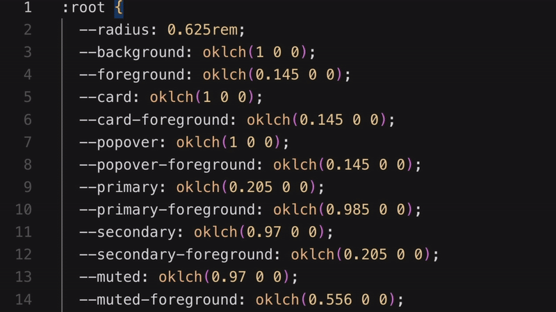
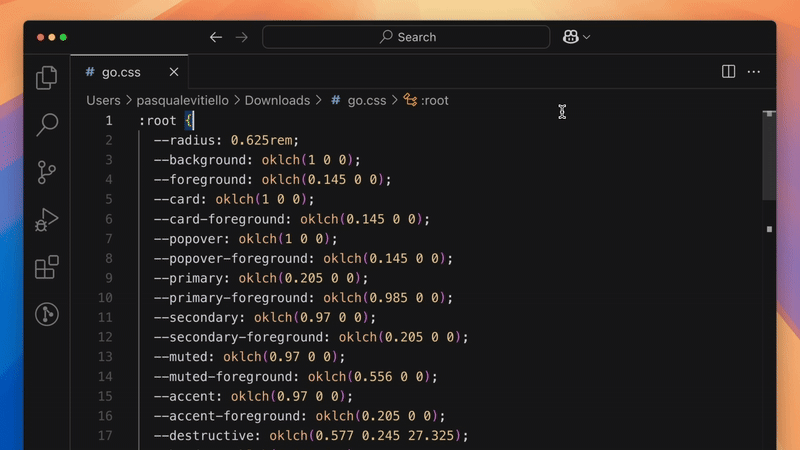
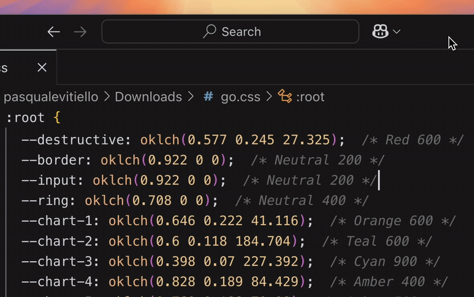
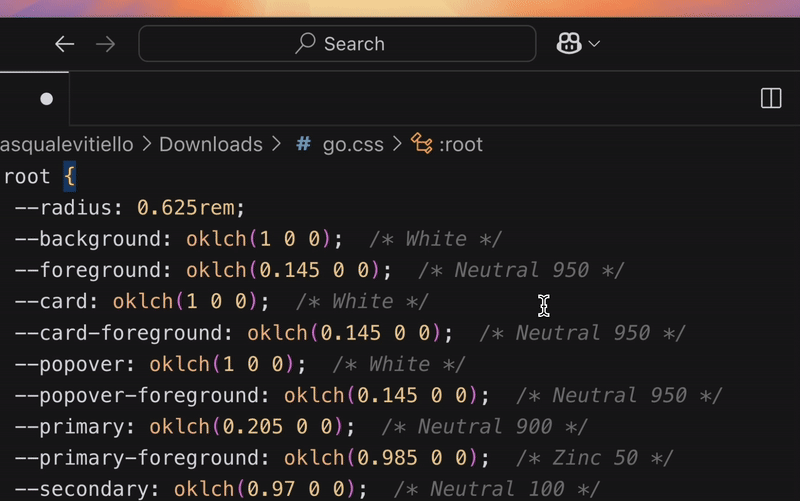

# Shadcn Color Tool

A Visual Studio Code extension that helps you work with OKLCH colors in your CSS files, particularly useful when working with Tailwind CSS and shadcn/ui.

## Features

- **Color Identification**: Hover over any `oklch()` color value to see its corresponding Tailwind color name
- **Quick Color Replacement**: Replace any `oklch()` color with a Tailwind color from a searchable list
- **Gray Scale Conversion**: Convert between different Tailwind gray scales (e.g., Slate to Zinc)
- **Color Annotation**: Add Tailwind color name comments to your `oklch()` values
- **Automatic Annotation**: Automatically update annotations on color changes
- **Annotation Cleanup**: Remove all color annotations with a single command

## Usage

### Tailwind color name preview on hover

Simply hover over any `oklch()` color value in your CSS files to see its corresponding Tailwind color name.

### Color Annotation

1. Open the Command Palette (`Ctrl+Shift+P` or `Cmd+Shift+P`)
2. Type "Shadcn Color Tool: Annotate OKLCH Colors with Tailwind Names" and select the command to add comments
3. Type "Shadcn Color Tool: Remove OKLCH Colors" and select the command to remove comments

### Quick color replacement

1. Place your cursor on an `oklch()` color value
2. Use the Quick Fix menu (lightbulb icon) or press `Ctrl+.` (Windows/Linux) or `Cmd+.` (Mac)
3. Select "Replace with a Tailwind color"
4. Choose your desired color from the searchable list

### Change all gray tones at once

1. Open the Command Palette
2. Type "Shadcn Color Tool: Change Base Color" and select the command
3. Choose your target gray scale (e.g., Slate, Zinc, etc.)
4. All gray scale colors in the current file will be converted to the selected scale

## Requirements

- Visual Studio Code 1.80.0 or higher

## Extension Settings

This extension contributes the following settings:

* `shadcn-color-tool.enable`: Enable/disable the extension

## Known Issues

None at the moment.

## Enhancements

Add inline color swatches for better visual feedback

## Release Notes

### 0.0.1

Initial release of Shadcn Color Tool.

## License

MIT License - see LICENSE.md for details

